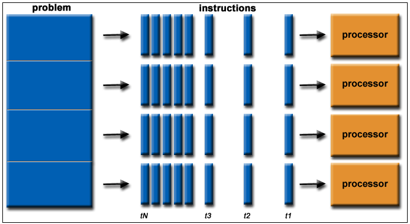
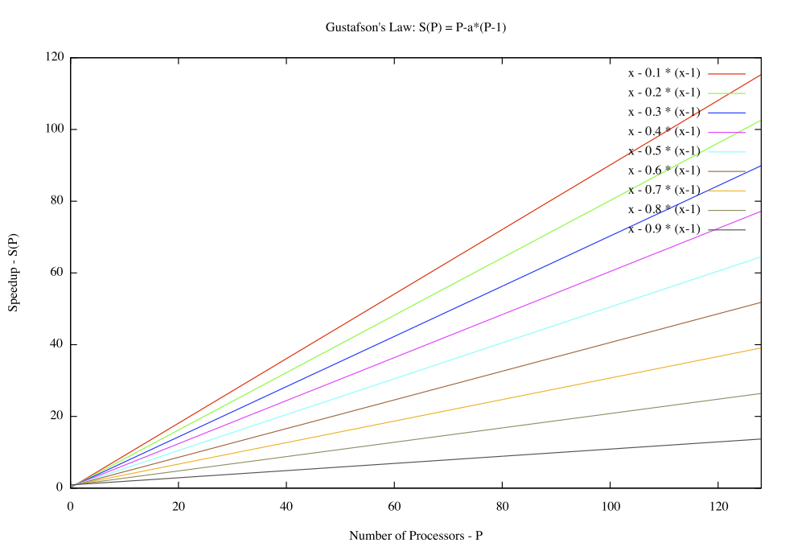
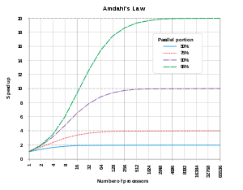
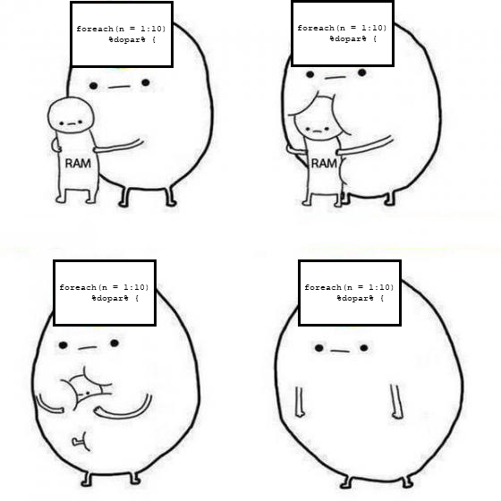

---
output:
  html_document:
    theme: sandstone
    toc: yes
    toc_depth: 3
    toc_float: yes
editor_options: 
  chunk_output_type: console
---
# Parallelization
  


[https://www.omnisci.com/](https://www.omnisci.com/technical-glossary/parallel-computing)
  
### Concept and terminology

Parallel computing is not unique to R and is used frequently by many programming languages and natively in your computer environment. With the widespread option of multiple core processors, parallel programming is becoming increasingly more common. At its most basic, parallel computing is **running multiple iterations of a process simultaenously (i.e., split) across multiple cores**. Essentially envision having two computers beside on another executing the task at hand. This analogy is particularly relevant because it helps frame conceptually what is going on with the computer and some of the draw backs or limitations of parallelization. 

In R, parallel computing can loosely categorized into two groups. 

1) User-specified parallel actions
2) Library-specified parallel execution
  
In the first instance, the user is doing most of the parallel work *manually*. This means identifying the processors to use, what process is to be run iteratively, how that process is to be split across cores, etc. There is some range in how specific a user choose options, but in this option, most elements need to be spelled out. Popular examples include `foreach`, `ddply`, and `parLapply`. 

In the second instance, a package has been written that allows the user to simply specify the number of cores to be used. The backend of how those cores are used has already been designed into the function either in `R` or another language (commonly C++). There are many examples, but one commonly used is `pdredge`. 

Before we dig into when to code in parallel and how to conduct it, we first need to go through some basic terminology. Unfortunately, termninology is not consistent in the parallel computing world. I am not entirely sure why this is the case, but I imagine it has something to do with different system architechs and programming languages developing their own nomenclature. For some consistency sake, I will use simplified termninology from what is provided by [Compute Canada](https://www.computecanada.ca/) and the `doParallel` package in R. 

Term   | Source | Definition
-------|--------|----------
Node   | CC     | A physical computational unit (e.g. a computer) that is comprised of cores and memory
Cluster‡| CC    | A group of interconnecting nodes
Core | CC & R   | A physical core processor with an associated set of memory (i.e. RAM)
Thread | IBM    | A virtual component meant to separate tasks
Tasks | CC      | A process that is to be executed by a core
Memory per cpu | CC     | The amount of memory (RAM) assigned to a core
Memory per node | CC    | The amount of memory (RAM) available on a node
Job  |  CC      | A submission to a super computer that requests computational resources and the tasks to be executed
Cluster‡ | R    | A virtual node generated by R comprised of multiple cores
FORK  |  R      | Fork cluster - shared memory environment across cores. Typically faster when using one node (Only available on Unix-based machines)
PSOCK  |  R      | Parallel socket cluster - Environment communicated across cores. Typically slower, but necessary when using multiple nodes (Available on both Windows and Unix machines)
‡ Super computers and high-throughput computing typically use a different definition of a *cluster* relative to R. In the computer science world it is meant to refer to multiple connected computers, but in R it is multiple connected cores. This can sometimes lead to confusion because R always uses clusters for parallel operations, but not all parallel operations on a super computer will use clusters. 

### Parallel computation in R

Let's explore a simple of example of parallel computing in R using `foreach`. This is a user-specified parallel action, and thus requires use to specify and register the cores to be used. If not unknown you should check how many cores are available on your computer. Typically it will be an even number with most computers having either 4 or 8 cores. As best practice, you should not use all your cores (typically n-1). Requesting all the computational resources will make your computer to struggle to operate programs outside of R (e.g. the OS, Chrome, Word) and the computer can crash or freeze. 

```{r warning=F, message=F}
library(doParallel)
library(foreach)

## Check the number of cores
detectCores()

## Set up cluster and the number of cores to be used 
cl <- makeCluster(4, type="PSOCK") ## specify number of cores, and type of cluster (PSOCK or FORK)
registerDoParallel(cl) ## register the backend into a virtual node

## Execute parallel operation
outLoop <- foreach(i = 1:5, .combine=c) %dopar% {
  print(i)
}
outLoop
```

The syntax with `foreach` shares commonality with `for` loops, but there are some notable differences. The first nuance, is that the specification of iterations requires an `=` sign rather than an `in` call. The next is the `%dopar%` operator. This is what commands the loop to run in parallel rather than sequentially. The `foreach` function can be executed in series simply by using `%do%` in place of `%dopar%`. The other difference is that `foreach` has many arguments that can be specified, all prefaced by a period. The argument we use here is the `.combine` which specifies how the outputs from each loop iteration are to be collated into the final object. This is particularly useful because it doesn't require setting up an empty dataframe to fill (as we did with for loops). 

Another commonly used argument is `.errorhandling` to decide what happens when an error occurs in the iteration. Similar to the `next` and `tryCatch` usage in for each, arguments can be specified here including `remove` or `pass` to continue the loop without the error. 

Let's look at a more complicated example and see the difference in run time. 

```{r message=F}
### Load penguin data
library(palmerpenguins)
penguins <- penguins[!is.na(penguins$body_mass_g),]
penguins <- data.frame(penguins) ## drop NAs and convert to  data.frame

## list species
speciesNames <- c("Adelie","Chinstrap","Gentoo")

## Set up cluster and the number of cores to be used 
cl <- makeCluster(4, type="PSOCK") ## specify number of cores, and type of cluster (PSOCK or FORK)
registerDoParallel(cl) ## register the backend into a virtual node

### Conduct in parallel
outCor <- foreach(i = 1:10000,  .combine=c) %dopar% {
bootDF <- penguins[sample(nrow(penguins), 100, replace=T),]
corVal <- cor(bootDF$bill_length_mm, bootDF$bill_depth_mm, use="complete.obs") ##conduct correlation
corVal
}
outCor[1:5]


```

One of the larger challenges with R and parallel computing is managing the environment workspace to the separate cores. Every object and package needs to be exported separetly for the operation to work in parallel. The particularly tricky part about this, there is often no error message provided. The code will simply be executed slowly in sequential order rather than parallel. 

It is good practice to export the environment and dataframes to each of the respective cores. While this may work on your personal computer, it will not always work and will infrequently run in parallel properly on a super computer. This is also true for exporting libraries. Let's take a look at what an error might look without specifying a package

```{r}
library(broom)


## Set up cluster and the number of cores to be used 
cl <- makeCluster(4, type="PSOCK") ## specify number of cores, and type of cluster (PSOCK or FORK)
registerDoParallel(cl) ## register the backend into a virtual node
clusterExport(cl, varlist=list("penguins")) ## export the dataframe to each core


outCor <- foreach(i = 1:1000,  .combine=rbind) %dopar% { ## combine dataframe of all linear models
bootDF <- penguins[sample(nrow(penguins), 100, replace=T),]
mi <- lm(bill_length_mm ~  bill_depth_mm, data=bootDF) ## conduct linear model
broom::tidy(mi) ## clean up output of linear models
}

## This can be solved by assigning the library to pull from or by specifying the library as an argument

outCor <- foreach(i = 1:1000,  .combine=rbind, .packages=c("broom")) %dopar% { ## combine dataframe of all linear models
bootDF <- penguins[sample(nrow(penguins), 100, replace=T),]
mi <- lm(bill_length_mm ~  bill_depth_mm, data=bootDF) ## conduct linear model
tidy(mi) ## clean up output of linear models
}

```


### Theory

Getting your code to run in parallel is great, but there is overhead. There is additional coding that you need to write out and more moving parts to troubleshoot. More importantly, there is a computational cost to running on multiple cores. This involves the time setting up the cluster, exporting the environment to the memory associated with each core, and communication between cores. The results is a non-linear decrease in processing time with the additional of more cores. In computer science this problem is referred to as scalable parallelism or Gustafson's Law, where a linear increase in speed is only accomplished with a large number of processors. 



This isn't a case against parallelization, but rather something to consider when trying to reduce run times. As an example, a script that takes 10 minutes on 1 core, won't take 5 minutes with 2 cores, and instead will likely take closer to 8 minutes to complete. Similarly, 4 cores will likely take 5 minutes rather than 2.5 minutes. Overall efficency is improved, just perhaps less than anticipated. Therefore, parallel operations should often be avoided for tasks that complete relatively quickly (<5 minutes). 

There is another computer science concept we need to think about when crafting parallel computation and that is Amdahl's law. The law refers to speed of the overall script will only be improved by parallelization for the parts that can be made parallel. What that means in an example is that if you script takes 1 hour to run, and the part that can be run in parallel only takes 5 minutes when executed in serial, the best improvement in time one can accomplish with an infinite number of cores is 55 minutes (i.e., 60 minutes - 5 minutes). Therefore, the more of the job to be run in parallel the faster it will complete.



However! Where this becomes particularly complicated is that your parallel script should actually be as simple as possible. It can be tempting to put `foreach` at the beginning of your script and run everything top-bottom changing only the necessary variables each iteration and throw enough cores at it to run faster. This strategy has two problems: one is with respect to efficiency and one is computational. To expore these problems, let's look at an example of modelling the response of a population to different climate patterns. 

### Problem 1: Choosing what to run in parallel

**Running in series**

```{r eval=FALSE}
### Load data
source("Parallelization//climSim.r")
head(climate)
head(population)


## Load random forest library
library(randomForest)

## Function to extract importance variables
impSort <- function(x) { 
  impDf <-   round(data.frame(x$importance),4)
  impDf <- impDf[order(impDf[,1], decreasing = T),]
  return(impDf)
}

## Conduct random forest
rf1 <- randomForest(population[,"Pop1"] ~ MAT + MAP + TMN + TMX, importance=T, ntree=1000)
rf1

## Create output variables
IF <- impSort(rf1)
rsq <- max(rf1$rsq)

## Load future climate
futureClimate <- data.frame(MAT = rnorm(10000, mean = 16, sd=3),
           MAP = rbinom(10000, size = 20, prob=0.05)*rnorm(2000,mean=12, sd=3),
           TMN = rnorm(10000, mean = -4, sd=3),
           TMX = rnorm(10000, mean = 35, sd=3))

## Predict future population change
futurePred <- median(predict(rf1, futureClimate))

## Output data.frame
output <- IF
output[,"ClimateVar"] <- row.names(output)
output[,"Population"] <- "Pop1"
output[,"RSQ"] <- rsq
output[,"futureVal"] <- futurePred

output


```

**Running everything in parallel**
```{r}
## Register backend
cl <- makeCluster(4, type="PSOCK")
registerDoParallel(cl)


#### Version 1 #####  Run everything in parallel
RFall <-  foreach(i = c("Pop1","Pop2","Pop3","Pop4"), .combine=rbind, .errorhandling = "remove", .packages=c("randomForest")) %dopar% {

### Load data
source("Parallelization//climSim.r")
head(climate)
head(population)
  
## Conduct random forest
rf1 <- randomForest(population[,i] ~ MAT + MAP + TMN + TMX, importance=T, ntree=1000)

## Create output variables
IF <- impSort(rf1)
rsq <- max(rf1$rsq)

## Load future climate
futureClimate <- data.frame(MAT = rnorm(10000, mean = 16, sd=3),
           MAP = rbinom(10000, size = 20, prob=0.05)*rnorm(2000,mean=12, sd=3),
           TMN = rnorm(10000, mean = -4, sd=3),
           TMX = rnorm(10000, mean = 35, sd=3))

## Predict future population change
futurePred <- median(predict(rf1, futureClimate))

## Output data.frame
output <- IF
output[,"ClimateVar"] <- row.names(output)
output[,"Population"] <- "Pop1"
output[,"RSQ"] <- rsq
output[,"futureVal"] <- futurePred

output
  
}
RFall

```

**Running select items in parallel**

```{r}
### Load data
source("Parallelization//climSim.r")
head(climate)
head(population)
futureClimate <- data.frame(MAT = rnorm(10000, mean = 16, sd=3),
           MAP = rbinom(10000, size = 20, prob=0.05)*rnorm(2000,mean=12, sd=3),
           TMN = rnorm(10000, mean = -4, sd=3),
           TMX = rnorm(10000, mean = 35, sd=3))


## Register backend
cl <- makeCluster(4, type="PSOCK")
registerDoParallel(cl)
clusterExport(cl, c("climate", "population", "futureClimate")) ## NB you need to specify cluster export for loaded variables


#### Version 2 #####  Run only modelling in parallel
RFall <-  foreach(i = c("Pop1","Pop2","Pop3","Pop4"), .combine=rbind, .errorhandling = "remove", .packages=c("randomForest")) %dopar% {

## Conduct random forest
rf1 <- randomForest(population[,i] ~ MAT + MAP + TMN + TMX, importance=T, ntree=1000)

## Create output variables
IF <- impSort(rf1)
rsq <- max(rf1$rsq)

## Predict future population change
futurePred <- median(predict(rf1, futureClimate))

## Output data.frame
output <- IF
output[,"ClimateVar"] <- row.names(output)
output[,"Population"] <- "Pop1"
output[,"RSQ"] <- rsq
output[,"futureVal"] <- futurePred

output
  
}
RFall

```

In the first version we have loading data within the loop and in the other we have it pulled out prior. The data variables will be the same across every iteration of the loop, thus we are losing efficiency by having this line of code run repeatedly over all the cores assigned. This slows down our overall run time and uses unnecessary computer power. This explains the problem of reduced efficiency, but there is also a problem with computational resources. 

### Problem 2: We require more minerals!



Anything contained within the loop must be exported to each core. Depending on the core specifications, this means duplication of the resources. Estimating resource consumption can be accomplished through basic arithmetic and monitoring resources (e.g., Task Manager in Windows). If an operation in series requires 2 GB, then executed across 4 cores will likely consume 8 GB. Most laptops come with between 8 and 16 GB RAM but with 8 cores. That means parallel computing is likely to fail from memory issues before being able to efficiently use all of its cores. This issue also re-appears on supercomputers where access to 20+ cores per computer can rapidly exhaust available memory (*oom-kill* events from SLURM). Keep in mind some of that memory will be dedicated to the operating system, having R open, and any other programs running (e.g., Chrome, Safari, Word). 


**Solutions to minimize memory usage**
- Trying to excute operations outside the loop is the most effective way to minimize this scaling issue. The loop should contain the least amount of data to execute properly. 
- Write outputs to disk rather than accumulate in the memory. This is especially true for complex objects, such as rasters, which will rapidy exhaust available memory when they could be written to hard-disk. 
- For Unix-based machines on a single computer, use FORK instead of PSOCK. FORK will used a shared environment and not duplicate objects. This will NOT work on a Windows based computer or on multiple computers set up as a cluster. 
- Break large tasks into smaller tasks. Turn one large loop into two loops, so less overhead is required. 


### Parallel Functions

With all that foundation in place, it makes sense to talk about the easier side of parallel computing in R. Some functions in R inherently have parallelization built into them because these functions typically take long to run. 

For instance, the above example of random forest we used the default settings. However, if we were trying to do a high quality random forest we would use `caret` package for model selection to pick the best settings. The `train` function from `caret` tunes the criteria of the random forest to best settings but requires fitting numerous models and resampling. This can be extremely time consuming because random forest on its own takes some time to iterate through all 1000 trees. Thus, `caret` has inherently installed parallelization that only requires cluster identification. 

```{r}
library(caret)


## Register backend
cl <- makeCluster(6, type="PSOCK")
registerDoParallel(cl)
clusterExport(cl, c("climate", "population", "futureClimate"))

## set training parameters
control <- trainControl(method='repeatedcv', 
                        number=10, 
                        repeats=3,
                        search = 'random')
## train random forest
tuneFit <- train(climate, population[,"Pop1"],
                 method="rf", 
                 tuneLength = 10,
                 trControl = control,
                 allowParallel = T) ## allow parallelization
tuneFit


## Unregister a parallel cluster
unregister_dopar <- function() {
  env <- foreach:::.foreachGlobals
  rm(list=ls(name=env), pos=env)
}
```

This is certainly the easier side of parallel computing in R. When dealing with a particularly slow function, you should explore if a parallel version already exists. More often than not, it is these bottleneck functions that are slowing down the overall computational time of your script that can be improved. 

### Super Computers

Super computers are attractive solutions to speeding up efficiency. They offer an near infinite number of processors and memory, reducing run times from weeks to hours or even minutes. They also have the benefit of not locking up your personal computer to execute some operation for hours. However, most super computers are not usable in real time and require you to submit a job to a scheduler. What this means is that you will typically require two files:

1) An R script - coded using the above methods for execution in parallel.
2) A bash script - that species computer resources to be used and how to execute the R script. 

There are two methods for coding in parallel on a super computer. We will go over both methods and what the bash script will look like for each. In **Method 1** the bash script simply specifies resources and R decides how to allocate tasks. In **Method 2** the bash script species resources and allocates tasks, while the R script runs in series. 

#### Method 1 - R executes in parallel

Here is what the example of a bash script might loop like

```{bash eval=FALSE}
#!/bin/bash
#SBATCH --account=def-someacct   # replace this with your account
#SBATCH --mem-per-cpu=10G    ## specify memory for operation
#SBATCH --cpus-per-task=1   # Specify processors assigned to each task
#SBATCH --ntasks=12               # number of processes (n+1, where n is what's requested in makeCluster)
#SBATCH --time=01:30:00           # time (HH:MM:SS)
#SBATCH --error=Practice.%J_%a.stdout ## create a log for any produced error messages from the scheduler
#SBATCH --output=Practice.%J_%a.stderr ## create a log of outputs - this is where most R warnings and messages populate

module load r/4.0.2 ## load R into workspace, specify the version

export R_LIBS=~/local/R_libs/ ## export the libraries install on root to the respective computer

Rscript testProgram.r ## run R script
```

This script sets the `testProgram.r` script to run with 12 cores and 120 G total of shared memory. Since almost all super computers are Unix-based, you can specify `FORK` rather than `PSOCK` which allows for shared memory. This means that if one core uses 11 GB, the job won't fail as long as there is an extra 1 GB that could be *borrowed* from another core. 

Notice we use one core more than we need. This is best practice to leave some processing power for the operating system of the cluster and to allow a backdoor access to job if needed to monitor or edit. 

One of the trickier things with job submissions is error checking. The bash script will begin running the R script top to bottom making debugging difficult. Its best to ensure a slightly simplier version of the script works on your personal computer in the entirety before experimenting with the super computer. 

Below is an example of an R script that could be executed using the above bash. 

```{r eval=FALSE}
## load libraries
library(doParallel)

## Register cluster
cl <- makeCluster(11, type="FORK") ## specify number of cores, and type of cluster (PSOCK or FORK)
registerDoParallel(cl) ## register the backend into a virtual node

foreach(i = 1:10000, .combine=c) %dopar% {
  cor(rnorm(1000,i, 2),rpois(1000, i))
}
```


#### Method 2 - Bash executes in parallel

Another approach is to leave the R script to run in series. Then get the bash script to submit separate jobs for the exact same R script except with select argument changed. This requires more knowledge on how to code in bash, but has the benefit of leaving the optimization to the scheduler. These will almost always execute faster. Below is an example of what that looks like. The trickier part is understanding how to communicated arguments between the bash and R scripts. Ideally, the R script should output to a file rather than compiling into a main vector or dataframe. 

```{bash eval=FALSE}
#!/bin/bash
#SBATCH --account=def-someacct   # replace this with your account
#SBATCH --mem-per-cpu=10G    ## specify memory for operation
#SBATCH --cpus-per-task=1   # Specify processors assigned to each task
#SBATCH --ntasks=12               # number of processes (n+1, where n is what's requested in makeCluster)
#SBATCH --time=01:30:00           # time (HH:MM:SS)
#SBATCH --error=Practice.%J_%a.stdout ## create a log for any produced error messages from the scheduler
#SBATCH --output=Practice.%J_%a.stderr ## create a log of outputs - this is where most R warnings and messages populate
#SBATCH --array=0-10 ## number of jobs to be submit

module load r/4.0.2 ## load R into workspace, specify the version

export R_LIBS=~/local/R_libs/ ## export the libraries install on root to the respective computer

## specify the separation of jobs
IDX=$(( SLURM_ARRAY_TASK_ID * 3 ))

## list the files to process files to process
declare -a speciespaths=( ~/projects/species/*.csv ) ## full list
TO_PROC=${speciespaths[@] :${IDX}:3}

## Run parallel 
parallel --env _ --jobs 3 Rscript ~/projects/SDMmodelling.r {} ::: ${TO_PROC}

```

Here is the R script that would pair with the above bash script. Notice how there is no loop or parallel calls. Yet this will be run in parallel almost as if on 30 separate computer simultaneously. 

```{r eval=FALSE}
## Load libraries
library(ENMeval)
library(raster)

### Load data
futureLocations <- read.csv("futureSites.csv")
currentClimate <- stack("currentClimate.tif")
futureClimate <- stack("futureClimate.tif")

## Load iteration from 
speciesFiles <- commandArgs(trailingOnly = TRUE)

## Get presence and psuedo-absence
spLoad <- read.csv(speciesFiles, stringsAsFactors = F)
backgr <- randomPoints(currentClimate, n=10000, p =sp1)  %>% data.frame()

## Run species distribution modelling
max1 <- ENMevaluate(spLoad, currentClimate, bg.coords = backgr,
                    fc = c("L", "Q", "P", "LQ", "HQ", "QPH", "QPHT", "LQHP"), RMvalues=seq(0.5, 3, 0.5))

## Predict occurrence with future climate
futurePred <- predict(futureSites, max1) ## determine probability for future climate
write.csv(futurePred, paste0("~/projects/out",speciesFiles))

```

For more details on how to use R on a super computer, Compute Canada has a good [Wiki](https://docs.computecanada.ca/wiki/R) on the topic. 