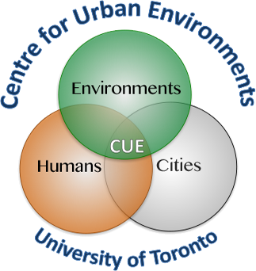

# Fast-R: Improving the reproducibility and efficiency of your coding

## Instructors

- [Alessandro Filazzola](http://www.filazzola.info) 
- [Sophie Breitbart](https://sophiebreitbart.wordpress.com/)

## General Information

With the wide-spread adoption of R for data management and analysis, there is huge potential for improving the efficiency of processing data. However, there is a significant learning curve with R that inhibits our ability to learn faster methods. Repetitive tasks in spreadsheets or even in R itself can often be revised to be faster, use less code, and have a simpler output One of the more appealing aspects of other programming languages for data science (Python, C++, SQL) relative to R is the speed that they can execute tasks. However, R has the capacity to function as fast, or better than some of these other languages with some additional parametrization.  This workshop will explore the power of “for” loops and parallel computing. These tools, while on the surface may appear intimidating, can be learned quickly with an exceptional payoff in time-saving efficiency. Using a combination of lecture and hands-on activities, this workshop will familiarize yourself with the tools necessary for improving your relationship with R and saving you time. A basic understanding of R is recommended because it will make the content more relevant and understandable. There is no prior knowledge necessarily for parallel computing or programming. Participants should bring a laptop with R already install using Mac, Linux, or Windows operating system (not a tablet, Chromebook, etc.). 

**Who**: The course is aimed at R beginners or experienced analysts.

**When**: Monday September 27, 2021 @ 5:30 PDT

**Where**: Virtual. [https://ucsb.zoom.us/j/83639325181](https://ucsb.zoom.us/j/83639325181)

**Requirements**: Participants should use a laptop with a Mac, Linux, or Windows operating system (not a tablet, Chromebook, etc.) with administrative privileges. Ideally, two screens would be beneficial to see the video and your workstation at the same time. However, participation is not necessary and you can simply follow along as we demonstrate. 

**Contact**: Please contact alex.filazzola@outlook.com for more information.

**Notes**: [Live Notepad]

**Feedback**: [Survey](https://easyretro.io/publicboard/yGVXR9eRebW4zP9Llz0XafsmuJe2/d7fc7d7f-98b7-45d3-b5ae-009b89bfb7b1)

## Learning objectives

1) Understand the basics of computer resources and how to best optimized their use.
2) Know the limitations associated with parallel computing and the specific instances where it can improve computation timing. 
3) Demonstrate the capacity to conduct an operation in parallel using two or more cores. 

## Schedule 
(time in PDT)

Time   | Goal
-------|------------
5:30   | Introduction - Why Iterate
5:40 | [Basic Loops](forloops/forLoops.html)
6:00  | [Parallelization](Parallelization/parallelization.html)
6:30 | Hack-a-thon
6:50 | Debrief and Q/A

**Past events**: We have previous run this workshop at [SORTEE 2021](https://www.sortee.org/events/) and [CSEE 2021](https://csee-scee2021.ca/). 

## Software

[R](http://www.r-project.org/) is a programming language that is especially powerful for data exploration, visualization, and statistical analysis. To interact with R, we use [RStudio](http://www.rstudio.com/).

Windows        |   Mac OS  X   |      Linux
---------------|---------------|---------------
Install R by downloading and running [this .exe](http://cran.r-project.org/bin/windows/base/release.htm) file from [CRAN](http://cran.r-project.org/index.html). Please also install the [RStudio IDE](http://www.rstudio.com/ide/download/desktop).| Install R by downloading and running [this .pkg](http://cran.r-project.org/bin/macosx/R-latest.pkg) file from [CRAN](http://cran.r-project.org/index.html). Please also install the [RStudio IDE](http://www.rstudio.com/ide/download/desktop).|You can download the binary files for your distribution from [CRAN](http://cran.r-project.org/index.html). Please also install the [RStudio IDE](http://www.rstudio.com/ide/download/desktop)

**Packages we will be using:** We recommend you install these ahead of time and ensure they load correctly to reduce troubleshooting in the workshop. 

## Other workshops

If you enjoyed this workshop and were interested in learning more, we have also run workshops on [Logistic Regression](https://github.com/afilazzola/CUELogisticRegression), an [Introduction to Ecological Analyses](https://afilazzola.github.io/UoA.CommunityAnalyses.2018/), an [Introduction to Functions](https://afilazzola.github.io/Intro2Functions/), and other tools for [improving speed in R](https://afilazzola.github.io/FastR/).

You can find similar style workshops, usually that are longer and go into more detail, with [Software Carpentry](https://software-carpentry.org/). They have teachers available globally and cover all forms of programming beyond R. 

 

## Thank You!

 

 Center for Urban Environments         |  University of Toronto
:-------------------------------------:|:-------------------------:
                |  
 
